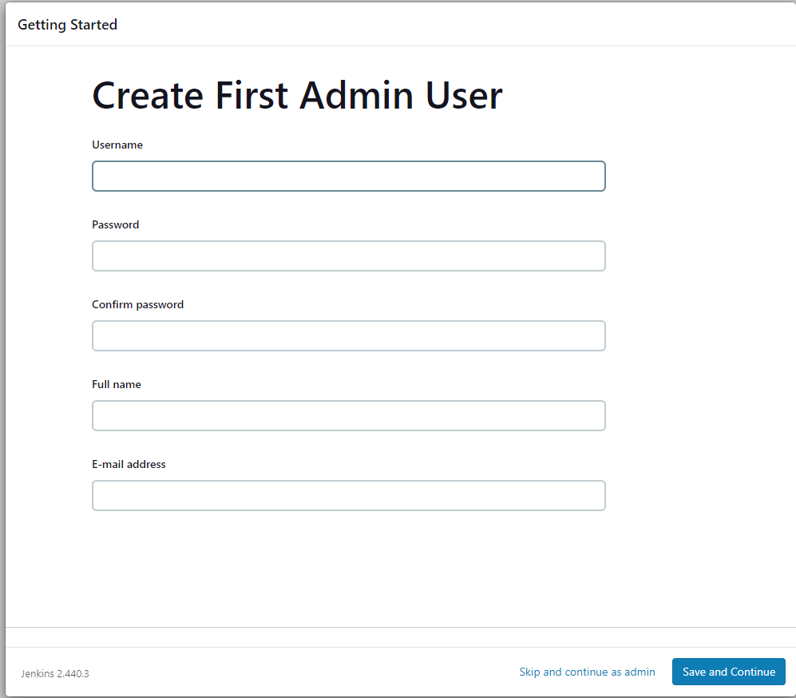

# How to make a jenkins server
1. Create an ubuntu instance on AWS (22.04)
2. Use the following script obtained from the Jenkins website to install java and jenkins
    ```bash
    #!/bin/bash
    sudo apt update -y
    sudo apt install fontconfig openjdk-17-jre -y
    java -version
    
    sudo wget -O /usr/share/keyrings/jenkins-keyring.asc \
      https://pkg.jenkins.io/debian-stable/jenkins.io-2023.key
    echo "deb [signed-by=/usr/share/keyrings/jenkins-keyring.asc]" \
      https://pkg.jenkins.io/debian-stable binary/ | sudo tee \
      /etc/apt/sources.list.d/jenkins.list > /dev/null
    sudo apt-get update -y
    sudo apt-get install jenkins -y
    ```
3. Connect to it using the public ip and adding `:8080` to the end to connect to port 8080 where jenkins is run
4. You will be asked for admin password found on the server itself so SSH in and find it here <br>
   - `sudo cat /var/lib/jenkins/secrets/initialAdminPassword`
5. Once you have put in the psasword you can install packages (continue with suggested for now)

6. Create an admin user



## Creating Jobs

1. Now that server is set up we can create our jobs 
2. We need to create 3 jobs:
   1. Job to test our app code from dev branch
   2. Job to merge dev branch to main branch after successful test
   3. Job to deploy application to server if merge was successful


