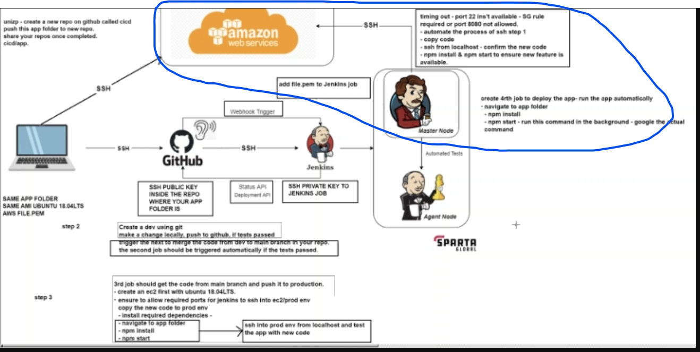
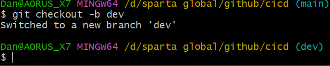
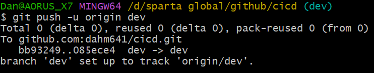
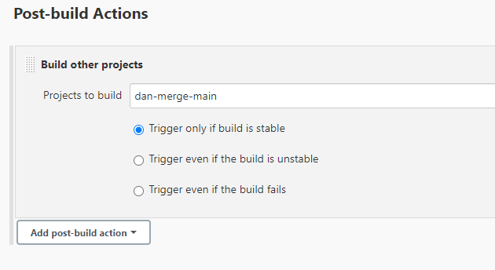
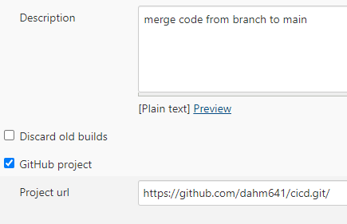
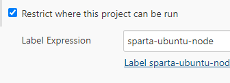
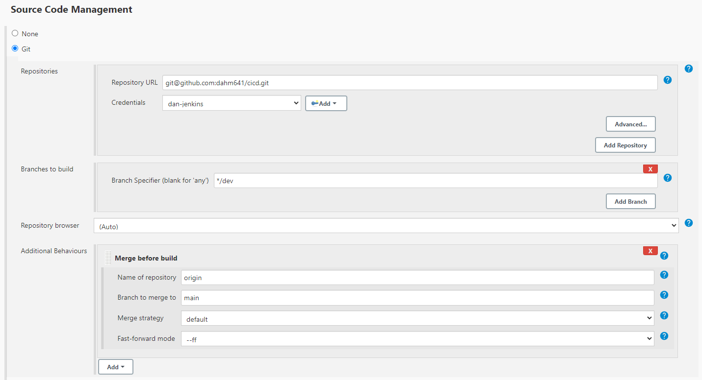
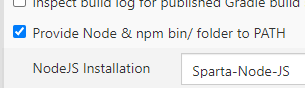
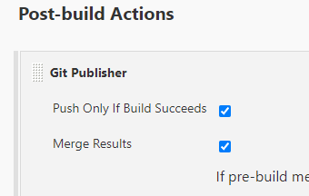

- [Using Jenkins and GitHub](#using-jenkins-and-github)
- [Creating a CI/CD pipeline](#creating-a-cicd-pipeline)
  - [What is a CI/CD pipeline](#what-is-a-cicd-pipeline)
  - [Why](#why)
  - [How](#how)
    - [CI](#ci)
    - [CD](#cd)
  - [Webhooks and nodes](#webhooks-and-nodes)
  - [Where](#where)
  - [When](#when)
  - [Create our testing job (CI Pipeline)](#create-our-testing-job-ci-pipeline)
    - [Adding webhook from GitHub](#adding-webhook-from-github)
  - [CD with Jenkins](#cd-with-jenkins)
    - [Step 1](#step-1)
      - [Job 1](#job-1)
      - [Job 2](#job-2)
    - [Step 2](#step-2)
    - [Step 3 (Deployment)](#step-3-deployment)
      - [Job 3](#job-3)
      - [Job 4 would be to create the database (this would actually be job 3) and would run before the deployment](#job-4-would-be-to-create-the-database-this-would-actually-be-job-3-and-would-run-before-the-deployment)
        - [Script](#script)


# Using Jenkins and GitHub

# Creating a CI/CD pipeline

- We want to create a simple pipeline for CI and CD
- Using a code located in a GitHub repository
- Want to push our code to GitHub in one branch
- Automatic test, merge, deploy
  - First job we need to do this is one that will automatically test our code as soon as it gets pushed
    - Achievable by using GitHub webhook trigger to trigger jenkins to start a job to test the code whenever anything gets pushed
  - Second Job then triggers after successful first job and merges this code with our main branch, so we can deploy it to production.
  - Third job will trigger after second job is successful and deploy code to an ec2 instance
- If any test fails it will alert us, so we can fix it and the pipeline will exit


## What is a CI/CD pipeline
- Continuous integration and continuous deployment pipeline. It is a series of automated steps that help to deliver new pieces of software/applications at at a fast rate. 
- It automates some stages of the SLDC such as building, testing and deploying code. 
- As soon as a developer finishes a piece of code whether that be a new feature or bug fix, they can send it through a pipeline which will not only build their code into the main application, but also test it to ensure it works as expected and works with the rest of the main code. 
- Using automation not only speeds up the process, it minimizes human error and is a standard and consistent process.
- Continuous integration is a fully automated build and test process to ensure what you have developed will work or not and will build it so that you can then release it.
- Continuous delivery is when new code gets built, tested and is ready to deploy. It is delivered to you but you still have to **manually** trigger the deployment. It will then automatically deploy it for you once you tell it to.
- Continuous deployment is where the entire process is completed for you automatically from build to deployment.


## Why
- It allows companies to deliver value to the end customer at a much faster rate
- Improves efficiency of development
- Gives them a competitive edge as they can easily stay up to date on latest technologies and market trends and new features can be added to an application rapidly using a CI/CD pipeline. 
- Enables faster delivery of products and services than competitors
- It has fewer man-hours involved which can save the company time as well - reduced operational costs
- Saves the company money by having fewer resources needed for development since the process is automated
- CI provides immediate feedback so can improve/fix code quicker
- Smaller code segments so also quicker to fix
- Increased velocity
- Better team morale working on iterative changes and seeing them in action


## How
- Using a number of different tools.
- For example, pushing the code to GitHub, then Jenkins pulling that code to test it and build it and deploy it on AWS EC2 instance.
 <br><br>
- At each stage we can see if it passes the automation and if not we can change the code so that it works and feed it back into the pipeline <br><br>
 <br><br>
- We have unit tests to see if the code is good and then integration tests to see if the code works with our app code.
- Use of webhooks to trigger the pipelines 

### CI

Once code is pushed it gets built and tested automatically. It either passes the pipeline once its passed the tests and is ready for deployment, or its sent back to fix some issues that didnt meet the testing requirements
### CD

Once the code has been tested, it can be either conitinously delivered, meaning we have to deploy it ourselves manually. This could be good for larger codes where we want to ensure everything is working how it should.
Or it can be continiously deployed where each change gets deployed automatically.

## Webhooks and nodes

- Webhooks are triggers to automate a series of tasks. This is useful in a pipeline because we want to automate things when a certain action is completed
- For example, on Amazon, when you order an item, it triggers an event to send you an email automatically. <br><br>
- A node is an instance that is created for running our different builds. 
- We can have a master node for production and maybe other nodes for testing to help separate environments and see error logs.

## Where
Any time software is being deployed, updates are being made, infrastructure as code is being changed, security is being added, any time when code is written that integrates or adds value to the application, having a pipeline will increase speed at which its deployed and also reliably deploy that code.

## When
It is adopted after the coding stage and automates the process of build, test and deploy so that code being developed can be deployed to the main application seamlessly and without needing human intervention, as long as it passes the testing. If not it tells you almost instantly so you can work on fixing it. 


## Create our testing job (CI Pipeline)

- This job was created in jenkins that will test our app that is on Github
- It is using the main branch but can be used for any branch (see below on CD pipeline where this is changed to a dev branch)


1. Create a repo on github using ssh keys that contains your app and folders <br><br>
 <br><br>
 <br><br>

2. Go to your jenkins server and login <br><br>
 <br><br>
3. Click create new item <br><br>
 <br><br>
4. Enter name and choose freestyle project then ok <br><br>
 <br><br>
5. In general, add a description to let others know what you're working on and select ***GitHub Project*** and paste in your https url from GitHub where your app repo is. <br><br>
 <br><br>
6. On the next section choose ***Restrict where this project can be run*** and choose sparta-ubuntu-node. (may have to try a few times). This creates a separate node away from the master node where we can test our app changes. <br><br>
 <br><br>
7. On source code management choose git and paste in you **SSH** URL from github <br><br>
 <br><br>
 <br><br>
8. Click add on credentials and click jenkins <br><br> 
 <br><br>
9. Choose SSH username with private key, click enter directly and then press add. Add your secret key here and don't forget to add a username <br><br>
 <br><br>
10. Select your newly added key and the branch <br><br>
 <br><br>
11. Add the build trigger for GitHub (webhook) So we can trigger a build to test our app everytime we push something to our connected GitHub. <br><br>
 <br><br>
12. Choose this option for build environment (set up for us in this jenkins instance) <br><br>
 <br><br>
13. On build choose execute shell and add the following commands: <br><br>
    ```
    cd app
    npm install
    npm test
    ```
    <br><br>  <br><br>
14. Click apply and save <br><br>
15. Click build now to test it <br><br>
 <br><br>
16. Click on the build  <br><br>
 <br><br>
17. Click console output <br><br>
 <br><br>
18. If working correctly should see this <br><br>
 <br><br>

### Adding webhook from GitHub
1. Go back to GitHub repo and go to settings and click ***Webhooks*** <br><br>
 <br><br>
2. Click ***Add webhook*** <br><br>
 <br><br>
3. Paste in your jenkins server URL endpoint and add `/github-webook/` at the end, choose push and choose active. <br><br>
 <br><br>
4. Test by pushing something to the repo and seeing it it triggers a new build <br><br>
 <br><br>
 <br><br>

## CD with Jenkins

  <br><br>

To make a CD pipeline with Jenkins, we need to automate certain steps using triggers. This could be webhooks or from jenkins builds being completed. We need to add the jobs to merge the code. We are using a new branch so creating that will be the first step.

### Step 1

1. Firstly create a new branch on the github repo. `git checkout -b dev`
 <br><br>
2. Push the dev branch so that its in our repo `git push -u origin dev`
 <br><br>

3. once we push a change it should automatically merge this with the main branch so we have to set up a job to do that. <br><br>
#### Job 1
   1. Create a job to test the push on the dev branch. When something gets pushed a job gets triggered to test the code. Same as CI steps before
    
         1. If successful then use a post build action to start a new job to merge the branches (need to set up next job before you can choose this so come back to it after) <br><br>
         <br><br>
#### Job 2 
1. Job to do this would be using the main branch and using `git merge dev` and then `git push -u origin main`
2. A better way would be to not rely on having git commands and use Jenkins to do this for us. <br><br>

**To set this up using jenkins follow the steps below:** <br><br>

1. Similar to above, create a new item in jenkins
2. Choose freestyle and give a name
3. Give a description, choose github project and paste in your HTTPS URL <br><br>
 <br><br>
4. Restrict it to the node we want to use <br><br>
 <br><br>
5. Choose Git for source code management and add additional behaviours.
6. Choose the branch `*/dev` name as `origin` and then branch to merge to as `main`
    - This will tell Jenkins to try merging dev branch to main branch to see if it works before building it <br><br>
 <br><br>
7. Choose node and npm for build environment <br><br>
 <br><br>
8. For post build actions choose Git publisher and choose merge and only if build succeeds  <br><br>
 <br><br>


### Step 2

Once its done this it needs to get pushed to production.

1. Create an EC2 instance in AWS with Ubuntu 18.04
2. Configure the security groups to allow port 22, 3000, 80 and 8080 to allow for jenkins to SSH into the instance


### Step 3 (Deployment)
1. Run a job to move the new files to the app folder, install everything and get it running automatically. start the app in the background after all other checks have been passed.

#### Job 3
1. Needs to copy the new data across from the main branch
2. Needs to SSH in without input to run commands
3. Needs to run update and upgrade commands
4. Install and run nginx
5. Go to the app folder
6. Install dependencies (can run a script available in main branch) 
7. start the app in the background
8. Need to go to app folder before installing dependencies or make them global

We can do this from Jenkins, however its best to write a script that we can just tell jenkins to run.

In our GitHub repository, we have a file called provisions.sh which can run to install many things we need rather than having to write them out in Jenkins.

You write your script in the execute shell in Jenkins

- `<<EOF` Starts a script and is needed otherwise it gets confused and throws an error. **NEED ANOTHER `EOF` AT END OF SCRIPT**

```
# copy new code
EC2_IP=3.254.78.64
rsync -avz -e "ssh -o StrictHostKeyChecking=no" app ubuntu@$EC2_IP:/home/ubuntu
rsync -avz -e "ssh -o StrictHostKeyChecking=no" environment ubuntu@$EC2_IP:/home/ubuntu

# by pass key checking step input
# ssh into ec2
ssh -o StrictHostKeyChecking=no ubuntu@$EC2_IP <<EOF
	
	
	#export DB_HOST=mongodb://172.31.34.192:27017/posts	
	# install the required dependicies by running provision.sh
    sudo chmod +x ~/environment/app/provision.sh
	sudo bash ./environment/app/provision.sh
    
EOF
```

Provisions script:

```bash
#!/bin/bash
# move to app folder
cd app
# install nodejs

sudo apt-get install python-software-properties -y
curl -sL https://deb.nodesource.com/setup_17.x | sudo -E bash -
sudo apt-get install nodejs -y


# install nginx
sudo apt-get install nginx -y 


# Update the sources list
sudo apt-get update -y

# upgrade any packages available
sudo apt-get upgrade -y


# install git
sudo apt-get install git -y

# Reverse proxy
sudo sed -i '51s/.*/\t        proxy_pass http:\/\/localhost:3000;/' /etc/nginx/sites-available/default

# Restart nginx for changes to take place
 
sudo systemctl restart nginx

# visit public ip and see if its running
sudo systemctl enable nginx


# Append the variable to /etc/environment
echo "DB_HOST=mongodb://54.171.140.180:27017/posts" | sudo tee -a /etc/environment >/dev/null

# Source /etc/environment to apply changes to the current session
source /etc/environment

# remove any instances of pm2 that could cause error
sudo rm -rf /usr/lib/node_modules/pm2

# install npm and pm2 and start the app 
sudo -E npm install
sudo npm install pm2 -g
sudo pm2 kill
sudo pm2 start seeds/seed.js
sudo pm2 start app.js
```
#### Job 4 would be to create the database (this would actually be job 3) and would run before the deployment

1. The set up is similar to deployment of the app.
2. We would need to copy the files over from github to the server then run our provisioning script
3. We would need to include the private IP into our app deployment script so it connects to it
4. Below is the jenkins deployment code and provision script

##### Script

Jenkins:

```bash
# copy new code
EC2_IP=public_ip_of_instance
rsync -avz -e "ssh -o StrictHostKeyChecking=no" environment ubuntu@$EC2_IP:/home/ubuntu
ssh -o StrictHostKeyChecking=no ubuntu@$EC2_IP <<EOF

		
	# install the required dependicies by running provision.sh
    sudo chmod +x ~/environment/db/provision.sh
	sudo bash ./environment/db/provision.sh
```
Provision.sh:

```bash
#!/bin/bash
# be careful of these keys, they will go out of date
sudo apt-key adv --keyserver hkp://keyserver.ubuntu.com:80 --recv D68FA50FEA312927
echo "deb https://repo.mongodb.org/apt/ubuntu xenial/mongodb-org/3.2 multiverse" | sudo tee /etc/apt/sources.list.d/mongodb-org-3.2.list

# install mongo db

sudo apt-get install mongodb-org=3.2.20 -y
sudo apt-get install -y mongodb-org=3.2.20 mongodb-org-server=3.2.20 mongodb-org-shell=3.2.20 mongodb-org-mongos=3.2.20 mongodb-org-tools=3.2.20
sudo apt-get update -y
sudo apt-get upgrade -y

# change bind ip
sudo sed -i 's/^\(\s*\)bindIp: .*/\1bindIp: 0.0.0.0/' /etc/mongod.conf
# if mongo is is set up correctly these will be successful

# enable mongo db
sudo systemctl enable mongod
sudo systemctl restart mongod
```

