# What is a CI/CD pipelinee
- Continiuos integration and continous deployment pipeline. It is a series of automated steps that help to deliver new pieces of software/applications at at a fast rate. 
- It automates some stages of the SLDC such as building, testing and deploying code. 
- As soon as a developer finishes a piece of code wheter that be a new feature or bug fix, they can send it through a pipeline which will not only build their code into the main application, but also test it to ensure it works as expected and works with the rest of the main code. 
- Using automation not only speeds up the process, it minimizes human error and is a standard and consistent process.
- Conitinous integration is a fully automated build and test process to ensure what you have developed will work or not
- Continious delivery is when new code gets built, tested and is ready to deploy. It is delivered to you and you hae to **manually* deploy it.
- Continious deployment is where the entire proces is completed for you automatically.


## Why
- It allows companies to deliver value to the end customer at a much faster rate
- Improves efficiency of development
- Gives them a competitive edge as they can easily stay up to date on latest technologies and market trends and new features can be added to an application rapidly using a CI/CD pipeline. 
- Enables faster delivery of products and services than competitors
- It has less man hours involved which can save the company time as well - reduced operational costs
- Saves the company money by having lses resources needed for development since the process is automated
- CI provides immediate feedback so can improve/fix code quicker
- Smaller code segments so also quicker to fix
- Increased velocity
- Better team morale working on iterative changes and seeing them in action


## How
- Using a number of different tools.
- For example, pushing the code to Github, then Jenkins pulling that code to test it and build it and deploy it on AWS EC2 instance.

- At each stage we can see if it passes the automation and if not we can change the code so that it works and feed it back into the pipeline
- 
- We have unit tests to see if the code is good and then integration tests to see if the code works with our app code.
- Use a webhook to trigger 


## Where
Any time software is being deployed, updates are being made, infrastructure is being changed, security is being added, any time whre some code is written that integrates or adds value to the application, having a pipeline will speed up and reliably deploy that code

# When
It is adopted after the coding stage and automates the process of build, test and deploy so that code being developed can be deployed to the main application seamlessly and without needing human intervention. 

# Using Jenkins and GitHub

## Create our own CI pipeline with jenkins and GitHub

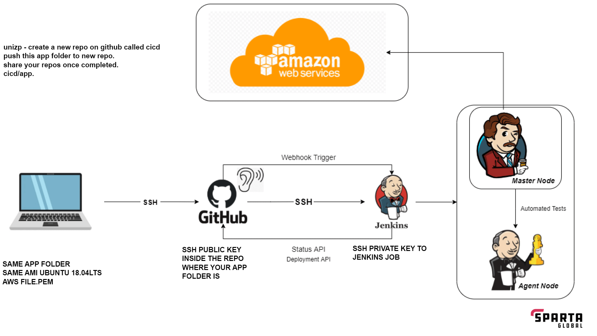

1. Create a repo on github using ssh keys that contains your app and folders
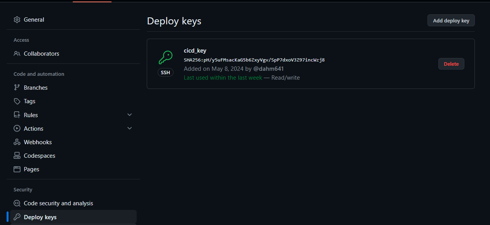 <br><br>
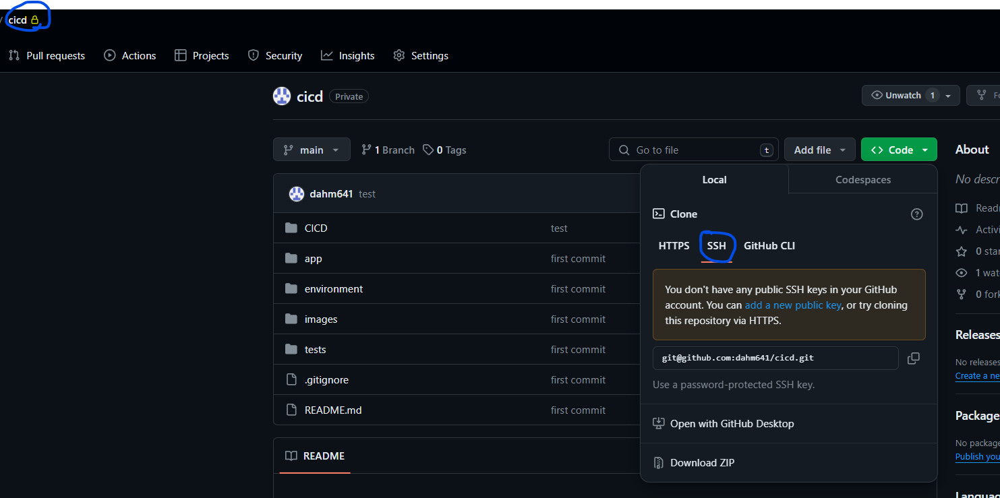

2. Go to your jenkins server and login
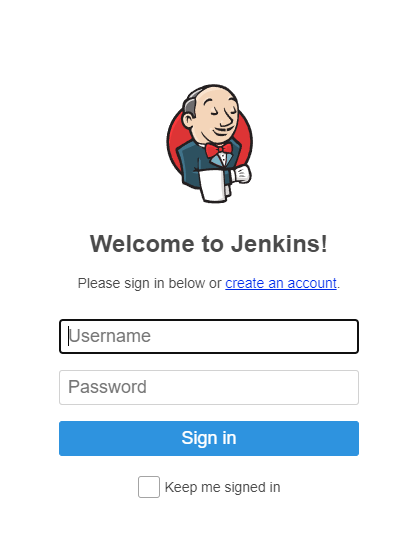
3. Click create new item
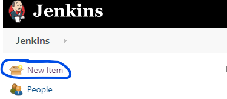
4. Enter name and choose freestyle project then ok
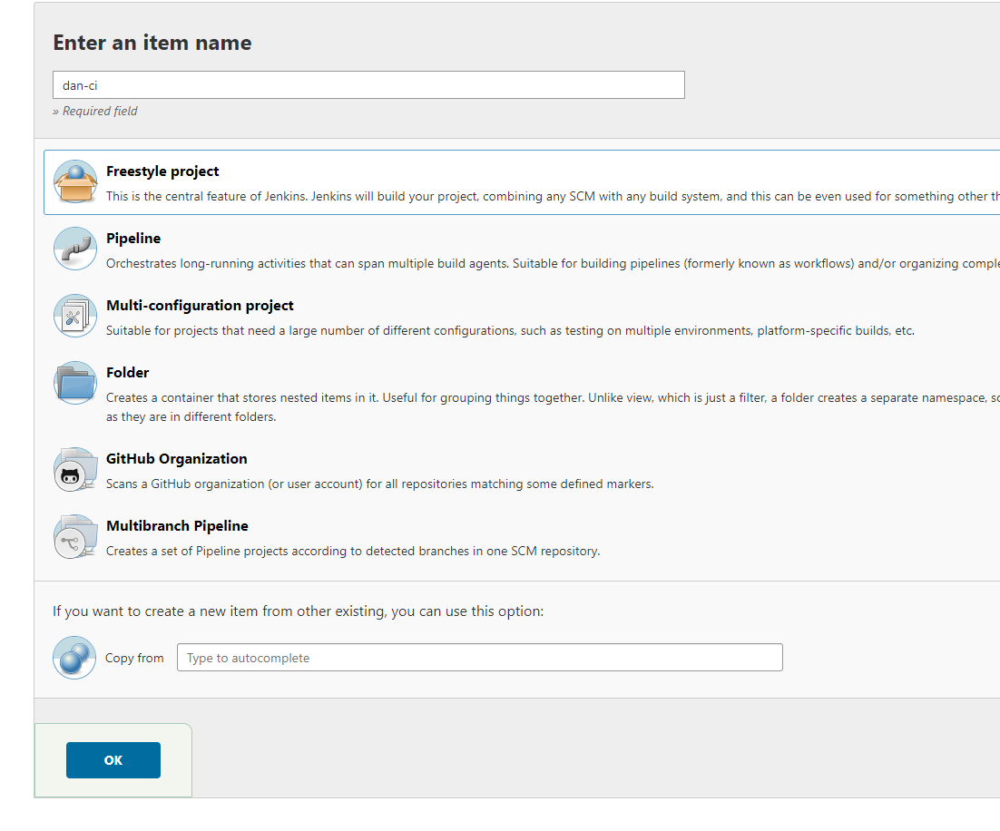
5. In general, add a description to let others know what you're working on and select ***GitHub Project*** and paste in your https url from github where your app repo is.
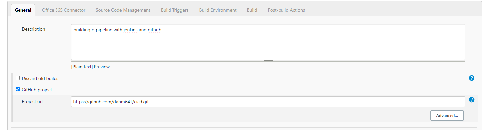
6. On the next section choose ***Restrict where this project can be run*** and choose sparta-ubuntu-node. (may have to try a few times). This creates a seperate node away from the master node where we can test our app changes.
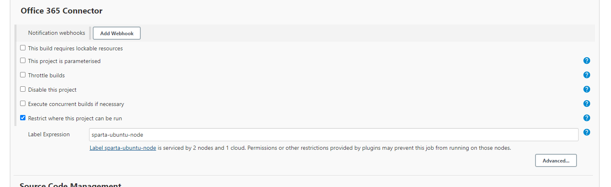
7. On source code managment choose git and paste in you **SSH** URL from github
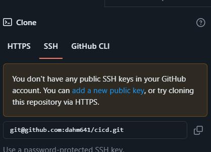
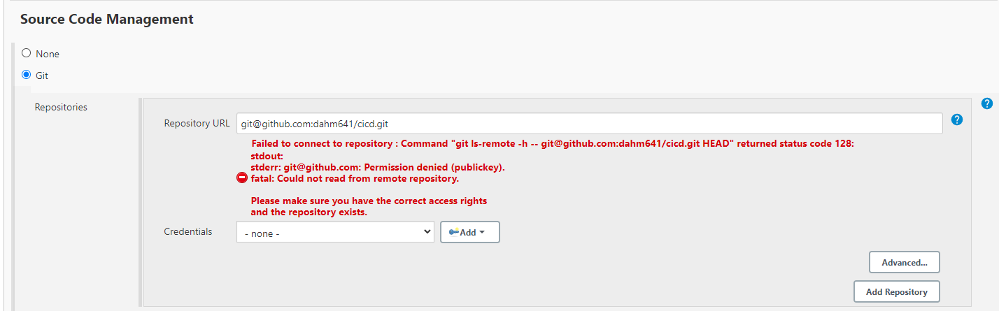
8. Click add on credentials and click jenkins 
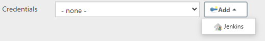
9. Choose SSH username with private key, click enter directly and then press add. Add your secret key here and dont forget to add a username

10. Select your newly added key and the branch
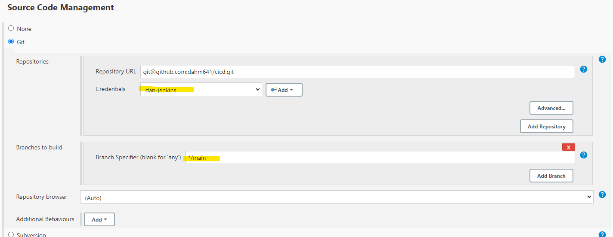
11. Add the build trigger for GitHub (webhook) So we can trigger a build to test our app everytime we push something to our connected GitHub.

12. Choose this option for build environment (set up for us in this jenkins instance)
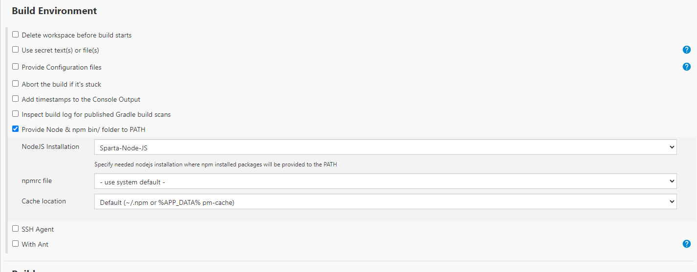
13. On build choose execute shell and add the following commands:
    ```
    cd app
    npm install
    npm test
    ```
    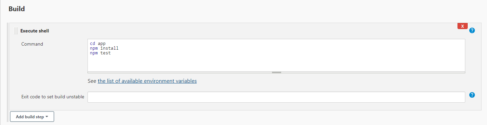
14. Click apply and save
15. Click build now to test it
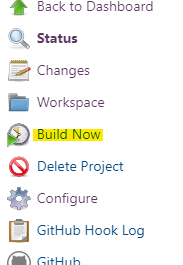
16. Click on the build 
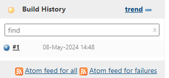
17. Click console output
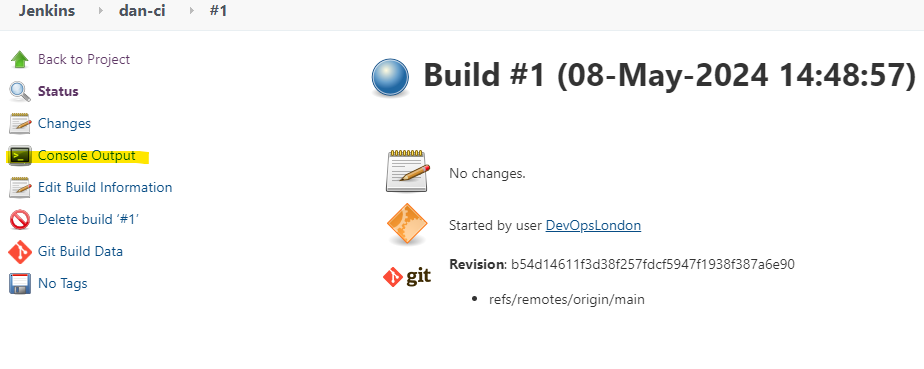
18. If working correctly should see this
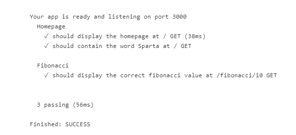

### Adding webhook from Github
1. Go back to Github repo and go to settings and click ***Webhooks***
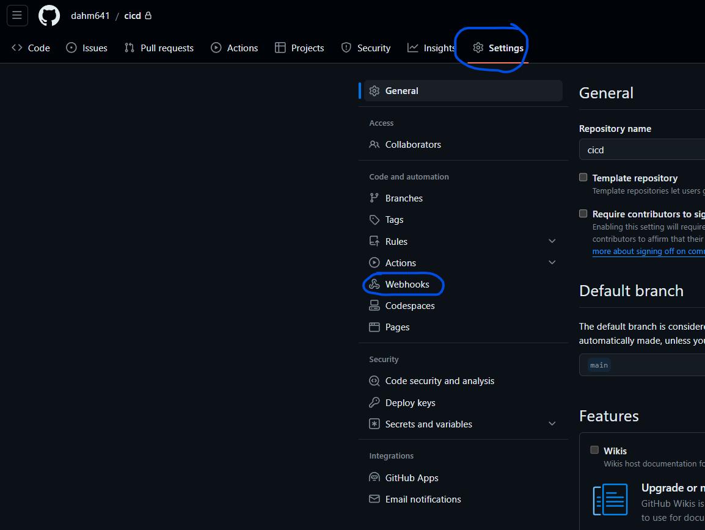
2. Click ***Add webhook***
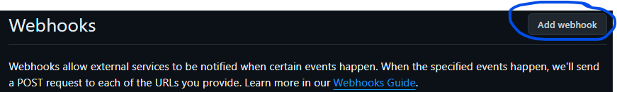
3. Paste in your jenkins server URL and add `github-webook/` at the end, choose push and choose active.
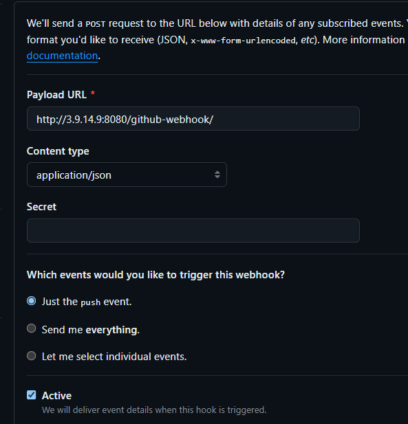
4. Test by pushing something to the repo and seeing itf it triggers a new build
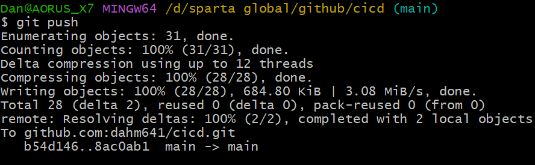
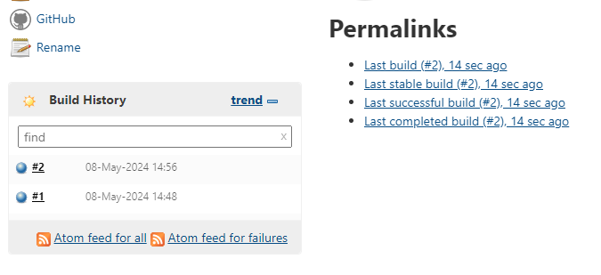
