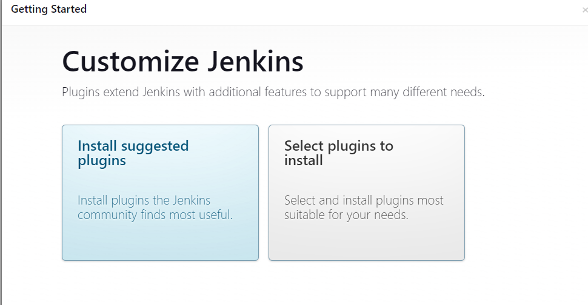

# What is a CI/CD pipeline
- Continuous integration and continuous deployment pipeline. It is a series of automated steps that help to deliver new pieces of software/applications at at a fast rate. 
- It automates some stages of the SLDC such as building, testing and deploying code. 
- As soon as a developer finishes a piece of code whether that be a new feature or bug fix, they can send it through a pipeline which will not only build their code into the main application, but also test it to ensure it works as expected and works with the rest of the main code. 
- Using automation not only speeds up the process, it minimizes human error and is a standard and consistent process.
- Continuous integration is a fully automated build and test process to ensure what you have developed will work or not and will build it so that you can then release it.
- Continuous delivery is when new code gets built, tested and is ready to deploy. It is delivered to you but you still have to **manually** trigger the deployment. It will then automatically deploy it for you once you tell it to.
- Continuous deployment is where the entire process is completed for you automatically from build to deployment.


## Why
- It allows companies to deliver value to the end customer at a much faster rate
- Improves efficiency of development
- Gives them a competitive edge as they can easily stay up to date on latest technologies and market trends and new features can be added to an application rapidly using a CI/CD pipeline. 
- Enables faster delivery of products and services than competitors
- It has fewer man-hours involved which can save the company time as well - reduced operational costs
- Saves the company money by having fewer resources needed for development since the process is automated
- CI provides immediate feedback so can improve/fix code quicker
- Smaller code segments so also quicker to fix
- Increased velocity
- Better team morale working on iterative changes and seeing them in action


## How
- Using a number of different tools.
- For example, pushing the code to GitHub, then Jenkins pulling that code to test it and build it and deploy it on AWS EC2 instance.
 <br><br>
- At each stage we can see if it passes the automation and if not we can change the code so that it works and feed it back into the pipeline <br><br>
 <br><br>
- We have unit tests to see if the code is good and then integration tests to see if the code works with our app code.
- Use of webhooks to trigger the pipelines 

### CI

Once code is pushed it gets built and tested automatically. It either passes the pipeline once its passed the tests and is ready for deployment, or its sent back to fix some issues that didnt meet the testing requirements
### CD

Once the code has been tested, it can be either conitinously delivered, meaning we have to deploy it ourselves manually. This could be good for larger codes where we want to ensure everything is working how it should.
Or it can be continiously deployed where each change gets deployed automatically.

## Webhooks and nodes

- Webhooks are triggers to automate a series of tasks. This is useful in a pipeline because we want to automate things when a certain action is completed
- For example, on Amazon, when you order an item, it triggers an event to send you an email automatically. <br><br>
- A node is an instance that is created for running our different builds. 
- We can have a master node for production and maybe other nodes for testing to help separate environments and see error logs.

## Where
Any time software is being deployed, updates are being made, infrastructure as code is being changed, security is being added, any time when code is written that integrates or adds value to the application, having a pipeline will increase speed at which its deployed and also reliably deploy that code.

## When
It is adopted after the coding stage and automates the process of build, test and deploy so that code being developed can be deployed to the main application seamlessly and without needing human intervention, as long as it passes the testing. If not it tells you almost instantly so you can work on fixing it. 

# Using Jenkins and GitHub

## Create our own CI pipeline with jenkins and GitHub


1. Create a repo on github using ssh keys that contains your app and folders <br><br>
 <br><br>
 <br><br>

2. Go to your jenkins server and login <br><br>
 <br><br>
3. Click create new item <br><br>
 <br><br>
4. Enter name and choose freestyle project then ok <br><br>
 <br><br>
5. In general, add a description to let others know what you're working on and select ***GitHub Project*** and paste in your https url from GitHub where your app repo is. <br><br>
 <br><br>
6. On the next section choose ***Restrict where this project can be run*** and choose sparta-ubuntu-node. (may have to try a few times). This creates a separate node away from the master node where we can test our app changes. <br><br>
 <br><br>
7. On source code management choose git and paste in you **SSH** URL from github <br><br>
 <br><br>
 <br><br>
8. Click add on credentials and click jenkins <br><br> 
 <br><br>
9. Choose SSH username with private key, click enter directly and then press add. Add your secret key here and don't forget to add a username <br><br>
 <br><br>
10. Select your newly added key and the branch <br><br>
 <br><br>
11. Add the build trigger for GitHub (webhook) So we can trigger a build to test our app everytime we push something to our connected GitHub. <br><br>
 <br><br>
12. Choose this option for build environment (set up for us in this jenkins instance) <br><br>
 <br><br>
13. On build choose execute shell and add the following commands: <br><br>
    ```
    cd app
    npm install
    npm test
    ```
    <br><br>  <br><br>
14. Click apply and save <br><br>
15. Click build now to test it <br><br>
 <br><br>
16. Click on the build  <br><br>
 <br><br>
17. Click console output <br><br>
 <br><br>
18. If working correctly should see this <br><br>
 <br><br>

### Adding webhook from GitHub
1. Go back to GitHub repo and go to settings and click ***Webhooks*** <br><br>
 <br><br>
2. Click ***Add webhook*** <br><br>
 <br><br>
3. Paste in your jenkins server URL endpoint and add `/github-webook/` at the end, choose push and choose active. <br><br>
 <br><br>
4. Test by pushing something to the repo and seeing it it triggers a new build <br><br>
 <br><br>
 <br><br>

## CD with Jenkins


To make a CD pipeline with Jenkins, we need to automate certain steps using triggers. This could be webhooks or from jenkins builds being completed.

### Step 1

1. Firstly create a new branch on the github repo. `git checkout -b dev`

2. Push the dev branch so that its in our repo `git push -u origin dev`

3. once we push a change it should automatically merge this with the main branch so we have to set up a job to do that.
#### Job 1
4. Create a job to test the push on the dev branch. When something gets pushed a job gets triggered to test the code. Same as CI steps before
5. If successful then use a post build action to start a new job to merge the branches
#### Job 2 & 3
6. Job to do this would be using the main branch and using `git merge dev` and then `git push -u origin main`

7. Once its been merged it should trigger a test again to see its all working correctly which is what was set up in the CI pipeline earlier

### Step 2

Once its done this it needs to get pushed to production.

1. Create an EC2 instance in AWS with Ubuntu 18.04
2. Configure the security groups to allow port 22, 3000, 80 and 8080 to allow for jenkins to SSH into the instance
#### Job 4
3. Create a job that SSH into the instance and copies the new code to this production server. Use pem file that is uploaded to jenkins.
4. Check the job has completed by manually SSH into the server and see if the files are there


### Step 3 (Delivery)

1. Install the required depeendencies
2. Navigate to the app folder and start the app

### Step 3 (Deployment)

#### Job 5

1. Run a job to autmatically start the app in the background after all other checks have been passed


